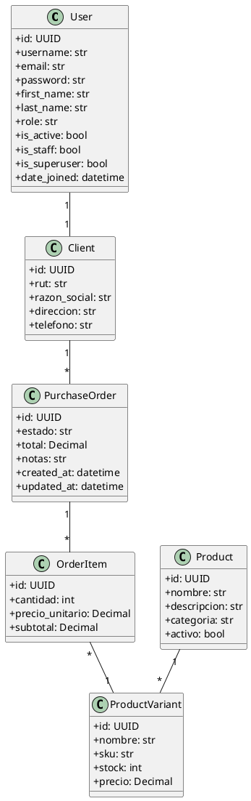

# 02. Modelo de Entidades - INSERF

Este documento describe las principales entidades del dominio para el sistema INSERF, incluyendo sus campos relevantes y relaciones.

---

## User

Usuario base del sistema. Puede ser un administrador o un cliente.

- id: UUID
- username: str
- email: str
- password: str
- first_name: str
- last_name: str
- role: str (choices: "admin", "client")
- is_active: bool
- is_staff: bool
- is_superuser: bool
- date_joined: datetime

---

## Client

Extensión del usuario para representar a un cliente registrado en el sistema.

- id: UUID
- user: ForeignKey to User (OneToOne)
- rut: str
- razon_social: str
- direccion: str
- telefono: str

---

## Product

Producto ofrecido por INSERF. Es una entidad general.

- id: UUID
- nombre: str
- descripcion: str
- categoria: str
- activo: bool

---

## ProductVariant

Variante específica de un producto, con stock y precio asociado.

- id: UUID
- product: ForeignKey to Product
- nombre: str
- sku: str
- stock: int
- precio: Decimal

---

## PurchaseOrder

Representa una orden de compra realizada por un cliente.

- id: UUID
- client: ForeignKey to Client
- estado: str (choices: "pendiente", "procesando", "completado", "rechazado")
- total: Decimal
- notas: str
- created_at: datetime
- updated_at: datetime

---

## OrderItem

Ítem individual dentro de una orden de compra.

- id: UUID
- purchase_order: ForeignKey to PurchaseOrder
- product_variant: ForeignKey to ProductVariant
- cantidad: int
- precio_unitario: Decimal
- subtotal: Decimal

---

## Relaciones Clave

- Un `User` con rol `"client"` tiene un `Client` relacionado (OneToOne).
- Un `Client` puede tener múltiples `PurchaseOrder`.
- Cada `PurchaseOrder` tiene múltiples `OrderItem`.
- Cada `OrderItem` está asociado a una `ProductVariant`.
- Cada `ProductVariant` pertenece a un `Product`.

---

## Diagrama PlantUML

